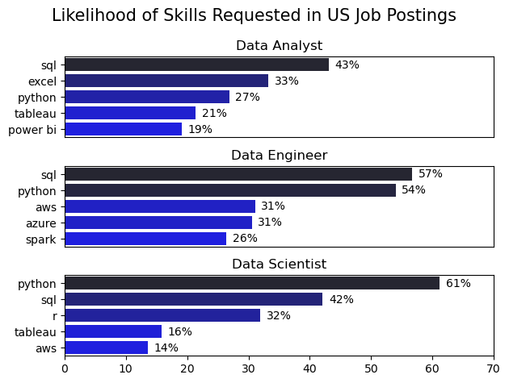
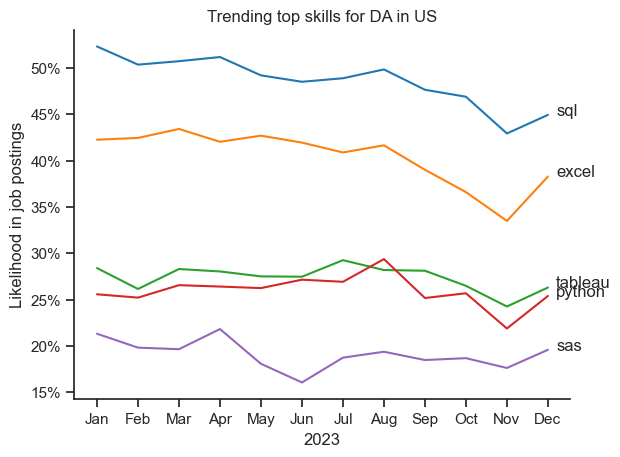

# Overview

Welcome to my analysis of the data job market, focusing on data analyst roles. This project was created out of a desire to navigate and understand the job market more effectively. It delves into the top-paying and in-demand skills to help find optimal job opportunities for data analysts.

The data sourced from Luke Barousse's Python Course which provides a foundation for my analysis, containing detailed information on job titles, salaries, locations, and essential skills. Through a series of Python scripts, I explore key questions such as the most demanded skills, salary trends, and the intersection of demand and salary in data analytics.

# The Questions

Below are the questions I want to answer in my project:

What are the skills most in demand for the top 3 most popular data roles?
How are in-demand skills trending for Data Analysts?
How well do jobs and skills pay for Data Analysts?
What are the optimal skills for data analysts to learn? (High Demand AND High Paying)
# Tools I Used

For my deep dive into the data analyst job market, I harnessed the power of several key tools:

- Python: The backbone of my analysis, allowing me to analyze the data and find critical insights. I also used the following Python libraries:
  - Pandas Library: This was used to analyze the data.
  - Matplotlib Library: I visualized the data.
  - Seaborn Library: Helped me create more advanced visuals.
- Jupyter Notebooks: The tool I used to run my Python scripts which let me easily include my notes and analysis.
- Visual Studio Code: My go-to for executing my Python scripts.
- Git & GitHub: Essential for version control and sharing my Python code and analysis, ensuring collaboration and project tracking.

# Data Preparation and Cleanup

This section outlines the steps taken to prepare the data for analysis, ensuring accuracy and usability.

# Import & Clean Up Data

This step involves importing the necessary libraries and loading the dataset, followed by initial data cleaning to ensure the data is accurate, consistent, and ready for analysis and visualization.
# The Analysis

## 1. What are the most demanded skills for the top 3 most popular data roles?

To find the most demanded skills for the top 3 most popular data roles, I filtered out those positions by which ones were the most popular, and got the top 5 skills for these top 3 roles. This query highlights the most popular job titles and their top skills, showing which skills I should pay attention to depending on the role I'm targeting.

View my notebook with detailed steps here:
[2_Skill_Demand.ipynb](3_Project\2_Skill_demand.ipynb)

### Visualize Data
```python 
fig,ax=plt.subplots(len(job_titles),1)

for i,job_title in enumerate(job_titles):
    df_plot=df_skill_perc[df_skill_perc['job_title_short']==job_title].head(5)
    #df_plot.plot(kind='barh',x='job_skills',y='skill_perc',ax=ax[i],title=job_title)
    sns.barplot(data=df_plot, x='skill_perc', y='job_skills', ax=ax[i], hue='skill_counts', palette='dark:b_r')
    ax[i].set_title(job_title)
    ax[i].set_ylabel('')
    ax[i].set_xlabel('')
    ax[i].legend().remove()
    ax[i].set_xlim(0,70)
    for n,v in enumerate(df_plot['skill_perc']):
        ax[i].text(v+1,n,f'{v:.0f}%',va='center')
    if i!=len(job_titles)-1:
        ax[i].set_xticks([])

fig.suptitle('Likelihood of Skills Requested in US Job Postings',fontsize=15)   
fig.tight_layout()
```
### Results

### Insights
- Python is a versatile skill, highly demanded across all three roles, but most prominently for Data Scientists (72%) and Data Engineers (65%).

- SQL is the most requested skill for Data Analysts and Data Scientists, with it in over half the job postings for both roles. For Data Engineers, Python is the most sought-after skill, appearing in 68% of job postings.

- Data Engineers require more specialized technical skills (AWS, Azure, Spark) compared to Data Analysts and Data Scientists who are expected to be proficient in more general data management and analysis tools (Excel, Tableau).

## 2. How are in-demand skills trending for Data Analysts?

### Visualize Data
```python
from matplotlib.ticker import PercentFormatter

df_plot = df_DA_US_percent.iloc[:, :5]

sns.lineplot(data=df_plot, dashes=False,
             legend='full', palette='tab10')

plt.gca().yaxis.set_major_formatter(
    PercentFormatter(decimals=0)
)

plt.show()
```
### Results




*Bar graph visualizing the trending top skills for data analysts in the US in 2023.*

### Insights:
- SQL remains the most consistently in-demand skill throughout the year, despite a slight decline toward the end.
- Excel shows a noticeable downward trend over time, with a sharp drop around November before recovering slightly in December.
- Tableau and Python exhibit relatively stable demand, fluctuating mildly but maintaining their importance across the year.
- Python peaks around mid-year, briefly surpassing Tableau, indicating a growing relevance in certain periods.
- SAS remains the least demanded skill among the group, with minor fluctuations and a slight dip mid-year.


## 3. How well do jobs and skills pay for Data Analysts?

### Salary Analysis for Data Nerds

#### Visualize Data
```python
sns.boxplot(data=df_us_top6,x='salary_year_avg',y='job_title_short',order=job_order)
plt.title('Salary distribution in the United States')
plt.xlabel('Yearly salary (USD$)')
ax=plt.gca()
ax.xaxis.set_major_formatter(plt.FuncFormatter(lambda x ,pos: f'${int(x/1000)}K'))
ax.set_ylabel('')
```
### Results

*Box plot visualizing the salary distributions for the top 6  data job titles.*
### Insights
- There is a significant variation in salary ranges across different job titles. The chart reveals that Senior Data Scientist positions possess the highest salary potential, reaching up to $600K, which emphasizes the high premium placed on advanced data analytics skills and experience within the industry.

- A considerable number of outliers are observable on the higher end of the salary spectrum, particularly within Senior Data Engineer, Senior Data Scientist, and interestingly, Data Scientist roles. This strong skew suggests that specific specialized skills, unique circumstances, or exceptional individuals can command pay far above the typical range for these positions. Conversely, Data Analyst roles (both junior and senior) show more consistency, with fewer extremes in their salary distributions.


- Median salaries increase in correlation with the complexity of the job function and level of seniority. Not only do Senior roles (Senior Data Scientist, Senior Data Engineer) command the highest median salaries, but they also exhibit larger variance (wider box ranges) in pay compared to other positions, indicating a broader market value for experienced professionals in these categories.
### Highest Paid & Most Demanded Skills for Data

#### Visualize Data
```python


fig,ax=plt.subplots(2,1)
sns.set_theme(style='ticks')
sns.barplot(data=df_da_us_top_pay,x='median',y=df_da_us_top_pay.index,ax=ax[0],hue='median',palette='dark:b_r')
sns.barplot(data=df_da_skills,x='median',y=df_da_skills.index,ax=ax[1],hue='median',palette='light:b')
ax[1].set_xlim(ax[0].get_xlim())
ax[0].set_ylabel('')
ax[1].set_ylabel('')
ax[0].legend().remove()
ax[1].legend().remove()
ax[0].set_title('Top 10 highest pay skills for DA')
ax[1].set_title('Top 10 most in-demand skills for DA')
ax[0].xaxis.set_major_formatter(plt.FuncFormatter(lambda x ,pos: f'${int(x/1000)}K'))
ax[1].xaxis.set_major_formatter(plt.FuncFormatter(lambda x ,pos: f'${int(x/1000)}K'))
ax[1].set_xlabel('Median yearly salary ($USD)')
fig.tight_layout()
```
### Results

*Two separate bar graphs visualizing the highest paid skills and most in-demand skills for data analysts in the US.*
### Insights
- The top graph shows specialized technical skills like dplyr, Bitbucket, and Gitlab are associated with higher salaries, some reaching up to $200K, suggesting that advanced technical proficiency can increase earning potential.

- The bottom graph highlights that foundational skills like Excel, PowerPoint, and SQL are the most in-demand, even though they may not offer the highest salaries. This demonstrates the importance of these core skills for employability in data analysis roles.

- There's a clear distinction between the skills that are highest paid and those that are most in-demand. Data analysts aiming to maximize their career potential should consider developing a diverse skill set that includes both high-paying specialized skills and widely demanded foundational skills.

## 4. What is the most optimal skill to learn for Data Analysts?

#### Visualize Data
```python
from adjustText import adjust_text
from matplotlib.ticker import PercentFormatter 
#df_da_skills_high_demand.plot(kind='scatter', x='skill_percent', y='median_salary')
sns.scatterplot(
    data=df_plot,
    x='skill_percent',
    y='median_salary',
    hue='technology',
    

)
sns.despine()
sns.set_theme(style='ticks')

texts = []
for i, txt in enumerate(df_da_skills_high_demand.index):
    texts.append(plt.text(df_da_skills_high_demand['skill_percent'].iloc[i], df_da_skills_high_demand['median_salary'].iloc[i], txt))

adjust_text(texts, arrowprops=dict(arrowstyle='->', color='gray'))
plt.xlabel('Percent of DA jobs')
plt.ylabel('Median Yearly Salary')
plt.title('Most optimal skills for data analyst in the us')
plt.legend(title='technology',loc='upper right', fontsize=9, title_fontsize=9)
ax=plt.gca()
ax.yaxis.set_major_formatter(plt.FuncFormatter(lambda y,pos: f'${int(y/1000)}k'))
ax.xaxis.set_major_formatter(PercentFormatter(decimals=0))
plt.tight_layout()
plt.show()
```
### Results

*A scatter plot visualizing the most optimal skills (high paying & high demand) for data analysts in the US.*

### Insights
- The scatter plot shows that most of the programming skills (colored blue) tend to cluster at higher salary levels compared to other categories, indicating that programming expertise might offer greater salary benefits within the data analytics field.

- Analyst tools (colored green), including Tableau and Power BI, are prevalent in job postings and offer competitive salaries, showing that visualization and data analysis software are crucial for current data roles. This category not only has good salaries but is also versatile across different types of data tasks.


- The database skills (colored orange), such as Oracle and SQL Server, are associated with some of the highest salaries among data analyst tools. This indicates a significant demand and valuation for data management and manipulation expertise in the industry.

### Conclusion
This exploration into the data analyst job market has been incredibly informative, highlighting the critical skills and trends that shape this evolving field. The insights I got enhance my understanding and provide actionable guidance for anyone looking to advance their career in data analytics. As the market continues to change, ongoing analysis will be essential to stay ahead in data analytics. This project is a good foundation for future explorations and underscores the importance of continuous learning and adaptation in the data field.